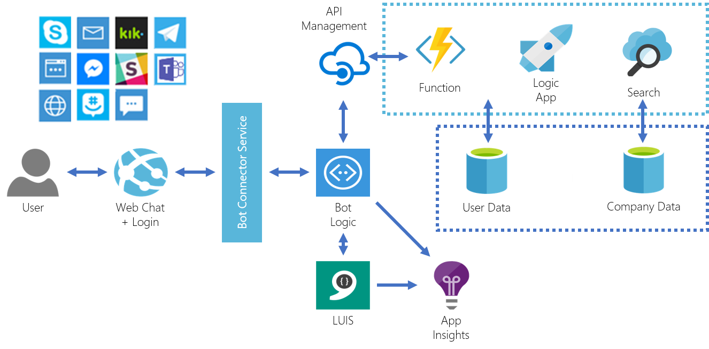

# Advanced bot on azure with NodeJs
This sample shows you how to deploy an advanced bot hosted on Azure Websites. 

For a complete end-to-end walk-through of creating this application, please refer to the [Bot Builder SDK for Node.js](https://docs.microsoft.com/en-us/bot-framework/nodejs/bot-builder-nodejs-overview)
This sample is based on https://github.com/Microsoft/BotBuilder-Samples/tree/master/Node/intelligence-LUIS

## Register your bot with Microsoft
Go to https://dev.botframework.com/bots and create a new bot.
Remember the app id and app password to enter it in the next step.
Make up a unique deployment name (best would be your initials and a two digit number).
The messaging endpoint will be https://{deployment_name}botweb.azurewebsites.net/api/messages
You can fill in the other values later.

## Deploying this sample
1. Deploy the arm template in arm/template.json to azure

  

It will deploy the following resources
- Azure Web App
- Logic App
- Application Insights
- Azure Search
- Cosmos DB
- LUIS API
- Bing Spell API
- Azure Function
- Code from github to the WebApp
- Configuration from all resource to environment variables in the web app and function

## Prepare your blank azure vm for development

1. Open Internet Explorer (does not work on Chrome) and paste the following URL: 

http://boxstarter.org/package/nr/url?https://raw.githubusercontent.com/denniszielke/hackbotsimple/master/scboxstarter.txt

2. Click Run on the security warning. 
3. Click Run again when prompted. 
4. This will take about 5 minutes and does the setup of prerequired software: Visual Studio Code, NodeJs, Git, Google Chrome, Fiddler4

## Set the environment variables for local dev test
1. Download the bot framework emulator from https://emulator.botframework.com/ 
2. Create an .env file by renaming the .env_template file and fill in the variables 

## Create a LUIS app and import the app
1. Go to https://luis.ai/ and import the file from the luis/LuisBot.json
2. Train the model and publish it
3. Insert the LUIS key from the arm template deployment into your app keys
4. Update the LUIS_MODEL_URL environment variable inside .env file with your published model url

See for additional documentation
https://docs.microsoft.com/en-us/azure/cognitive-services/luis/luis-nodejs-tutorial-build-bot-framework-sample

## Run the bot locally
1. Run npm install to install the dependencies
2. Run the bot in debug mode in VSCode
3. Connect the bot emulator to your instance running on localhost (appid and apppassword have to be empty for localhost)